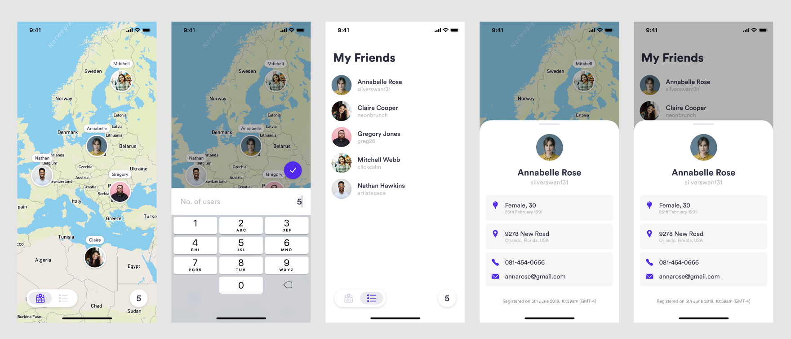

# UsersMap iOS app

Example iOS app using UIKit + MVVM-C + MapKit + TDD

### UI

### Features
This repository consists of prototype of an app app that will fetch a list of users from [https://randomuser.me/](https://randomuser.me/).

- Fetched users should are displayed in a scrolling list and on a map 
- Tapping on a user in the list, or annotation in the map view, displays the user details in a panel
- Tapping on a number view (bottom right corner) brings the text field up to where one can enter a number which will then be used for fetching users from the API
